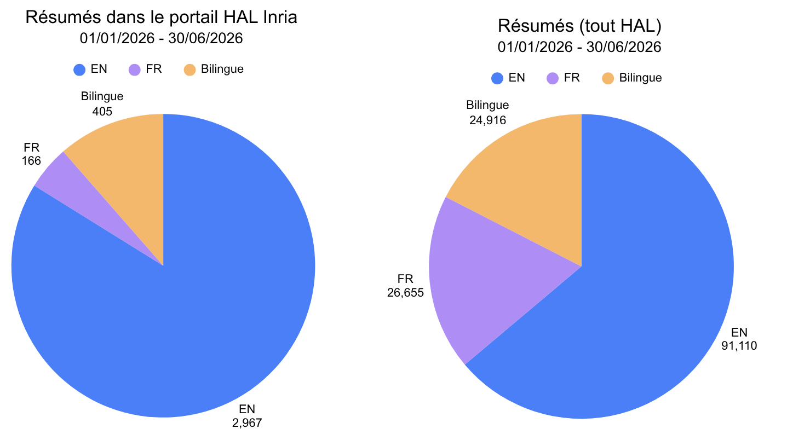
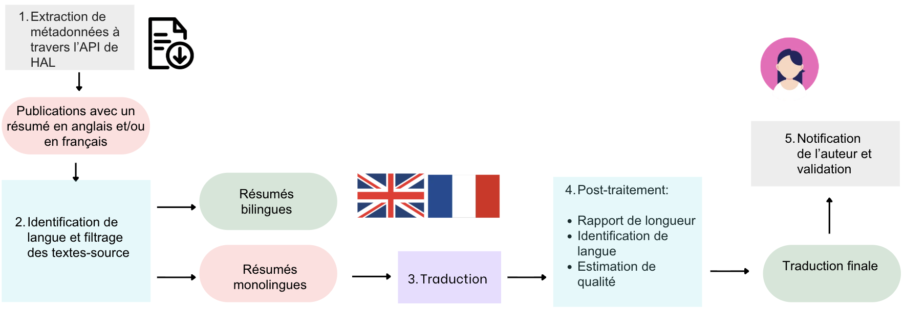

# Objectifs du pipeline

Le pipeline présenté ici fournit des traductions pour les résumés de publications dans l'archive HAL. Chaque publication dans HAL dispose d'une fiche de métadonnées contenant un champ pour le résumé de la publication en anglais et un champ pour le résumé en français. Cependant, 64% des publications déposées dans la première moitiée de l'année 2026 contiennent seulement un résumé en anglais. Ce taux s'élève à 84% pour les publications incluses dans le portail [HAL Inria](https://inria.hal.science/), qui contient notamment des publications dans le domaine de l'informatique. 

Le but de ce pipeline est donc de rendre les publications scientifiques plus accessibles et plus visibles sur le web grâce à l'enrichissement de leurs métadonnées avec des résumés bilingues en anglais et en français. Comme indiqué dans les graphes ci-dessus, parmi les publications déposées dans HAL entre le 1er janvier et le 30 juin 2026, seulement 17% disposent d'un résumé bilingue. Ce taux tombe à 11% pour les publications du portail HAL Inria. 

# Structure

Le pipeline est structuré en cinq étapes : 

1. La récupération de métadonnées à partir de HAL 
2. Le prétraitement appliqué aux résumés 
3. La traduction des résumés monolingues 
4. Le post-traitement et l'estimation de la qualité des traductions produites 
5. La notification des auteurs, qui peuvent valider, modifier ou rejeter la traduction du résumé de leur publication